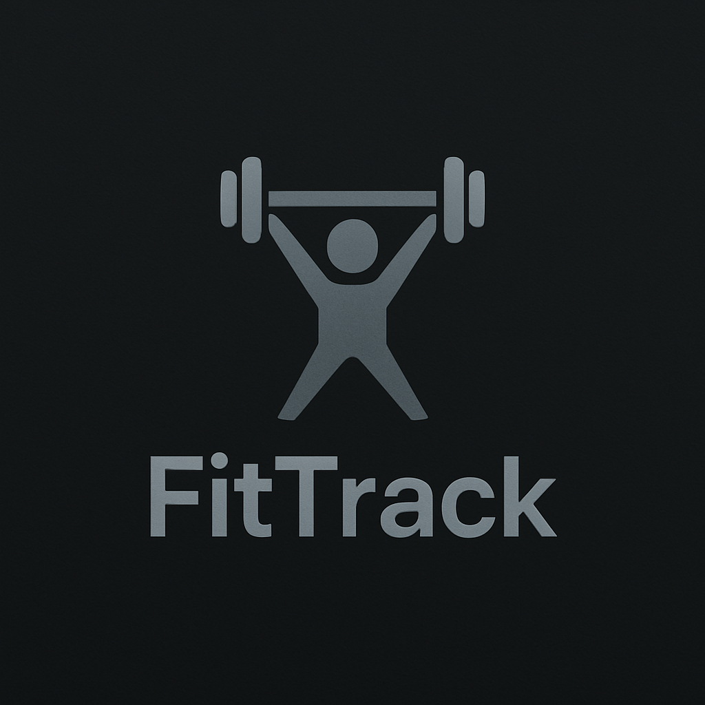
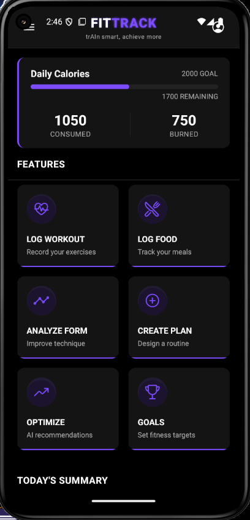
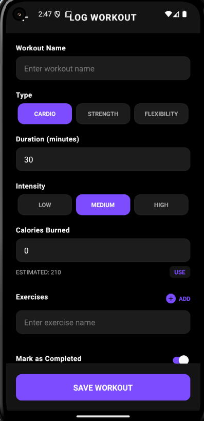
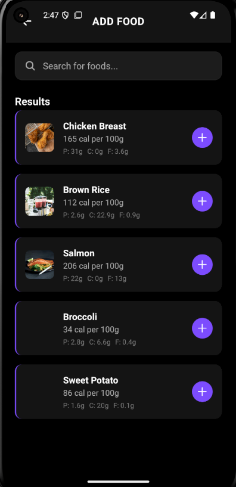
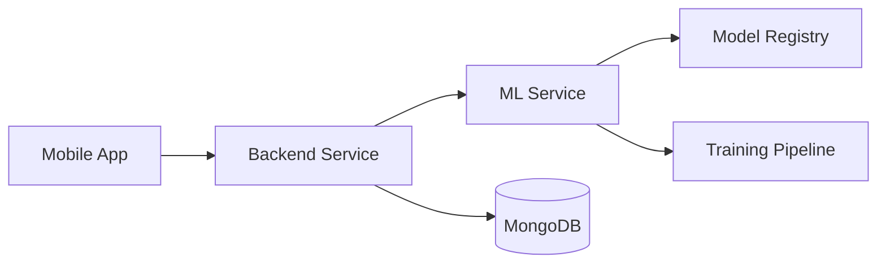

# FitTrack

<div align="center">
  
  <h3>AI-Powered Fitness Companion</h3>
</div>

<div align="center">

[](https://reactnative.dev/)
[](https://expo.dev/)
[](https://nodejs.org/)
[](https://www.python.org/)
[](https://www.tensorflow.org/)

*Your personal AI fitness coach that helps you achieve your fitness goals with real-time form analysis and personalized workout plans.*

[Getting Started](#getting-started) • [Features](#features) • [Architecture](#architecture) • [Documentation](#documentation) • [Contributing](#contributing)

</div>

## 📱 App Showcase

<div align="center">
  <table>
    <tr>
      <td align="center"><strong>Dashboard</strong></td>
      <td align="center"><strong>Log Workout</strong></td>
      <td align="center"><strong>Track Nutrition</strong></td>
      <td align="center"><strong>Form Analysis</strong></td>
    </tr>
    <tr>
      <td></td>
      <td></td>
      <td></td>
      <td></td>
    </tr>
  </table>
</div>

## 🚀 Features

### Mobile App
- 📱 Cross-platform support (iOS & Android)
- 🎥 Real-time exercise form analysis
- 🎯 Personalized workout plans
- 📊 Progress tracking & analytics
- 🤖 AI-powered recommendations
- 🌙 Dark/Light theme support

### Backend Service
- 🔐 JWT authentication
- 📝 RESTful API
- 📦 MongoDB integration
- 📈 Performance monitoring
- 🔄 Automated backups

### ML Service
- 🏃‍♂️ Real-time pose estimation
- ✅ Exercise form validation
- 📈 Progress prediction
- 🎯 Plan optimization
- 🧠 Continuous learning

## 🏗 Architecture



## 💻 Tech Stack

### Mobile App (React Native + Expo)
- Navigation: React Navigation
- State Management: Redux Toolkit
- UI Components: React Native Paper
- Camera: Expo Camera
- Animations: React Native Reanimated

### Backend Service (Node.js)
- Framework: Express.js
- Database: MongoDB
- Authentication: JWT
- API Documentation: Swagger
- Testing: Jest

### ML Service (Python)
- Deep Learning: TensorFlow
- Computer Vision: OpenCV
- API: FastAPI
- Model Serving: TensorFlow Serving
- Monitoring: MLflow

## 🚀 Getting Started

### Prerequisites
- Node.js 18+
- Python 3.9+
- MongoDB 6+
- Android Studio / Xcode

### Quick Start

1. Clone the repository:
```powershell
git clone https://github.com/yourusername/FitTrack.git
Set-Location FitTrack
```

2. Install dependencies:
```powershell
# Mobile App
Set-Location FitTrack_MVP/1_code/fittrack-expo
npm install

# Backend
Set-Location ../backend
npm install

# ML Service
Set-Location ../ml_service
python -m venv venv
.\venv\Scripts\Activate.ps1
python -m pip install -r requirements.txt
```

3. Start the services:
```powershell
# Start MongoDB
mongod

# Start Backend (new terminal)
Set-Location backend
npm run dev

# Start ML Service (new terminal)
Set-Location ml_service
python app.py

# Start Mobile App (new terminal)
Set-Location fittrack-expo
npm start
```

## 📚 Documentation

- [Mobile App Documentation](FitTrack_MVP/1_code/fittrack-expo/README.md)
- [Backend Documentation](FitTrack_MVP/1_code/backend/README.md)
- [ML Service Documentation](FitTrack_MVP/1_code/ml_service/README.md)
- [API Documentation](FitTrack_MVP/1_code/backend/docs/api.md)
- [Development Guide](FitTrack_MVP/docs/development.md)
- [Deployment Guide](FitTrack_MVP/docs/deployment.md)

## 🧪 Testing

```powershell
# Run Mobile App Tests
Set-Location fittrack-expo
npm test

# Run Backend Tests
Set-Location backend
npm test

# Run ML Service Tests
Set-Location ml_service
pytest
```

## 🔒 Security

- All API endpoints are secured with JWT authentication
- ML models are protected against adversarial attacks
- Regular security audits and dependency updates
- Data encryption at rest and in transit

## 🤝 Contributing

1. Fork the repository
2. Create your feature branch
3. Commit your changes
4. Push to the branch
5. Create a Pull Request

See [CONTRIBUTING.md](CONTRIBUTING.md) for detailed guidelines.

## 📝 License

This project is licensed under the MIT License - see the [LICENSE](LICENSE) file for details.

## 🙏 Acknowledgments

- [TensorFlow](https://www.tensorflow.org/) for ML models
- [React Native](https://reactnative.dev/) for mobile development
- [Expo](https://expo.dev/) for app development tools
- [MongoDB](https://www.mongodb.com/) for database
- All contributors who have helped shape FitTrack

---

<div align="center">

Made with ❤️ by the FitTrack Team

[Website](https://fittrack.com) • [Documentation](https://docs.fittrack.com) • [Community](https://community.fittrack.com)

</div>
